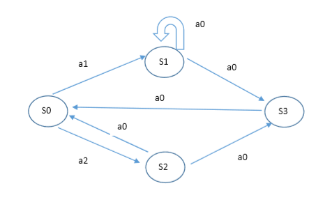
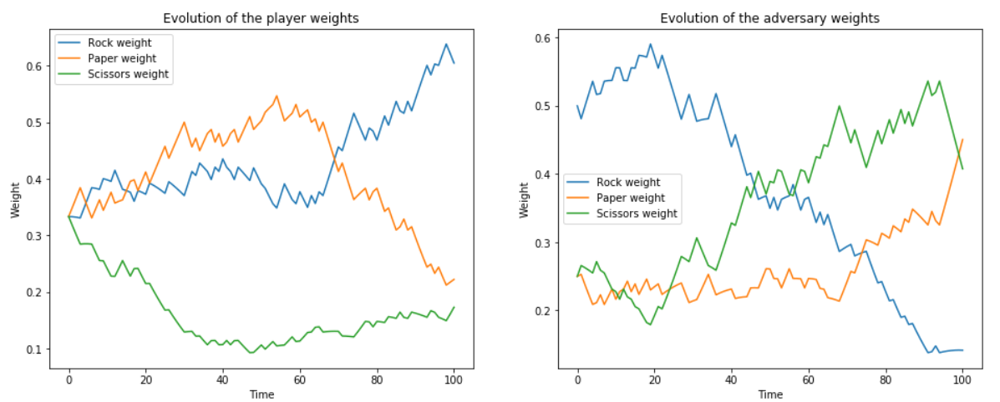

# Reinforcement Learning practical work
Compilation of work and assignments with my solutions for reinforcement learning thematic.
  
---
  
## Value iteration algorithm
[Value iteration algorithm implementation]() for MDP graph:

## Exercices with OpenAI Gym

### 1. [Dynamic programming](./openai_gym/dynamic_programming/Dynamic_Programming.ipynb)
Implementation of Dynamic Programming algorithms such as Policy Evaluation, Policy Improvement, Policy Iteration, and Value Iteration.

### 2. [Monte Carlo methods](./openai_gym/monte-carlo-methods/Monte_Carlo.ipynb)
Implementation of Monte Carlo methods for prediction and control in [Black Jack environment](https://github.com/openai/gym/blob/master/gym/envs/toy_text/blackjack.py)

## Bandits strategies
*Work done during the course of Thomas Bonald and Pierre Gaillard at Telecom Paris.*
  
### 1. [Stochastic bandits]()
Implementation and test of the performance of some usual bandit algorithms.
* 𝜀 -greedy
* adaptive greedy
* UCB
* Thompson sampling

### 2. [Adversarial bandits](./master/bandits_strategies/adversarial-bandits/Adversarial_bandits.ipynb)
Implementation of EXP3 algorithm for simple player vs adversary game.

